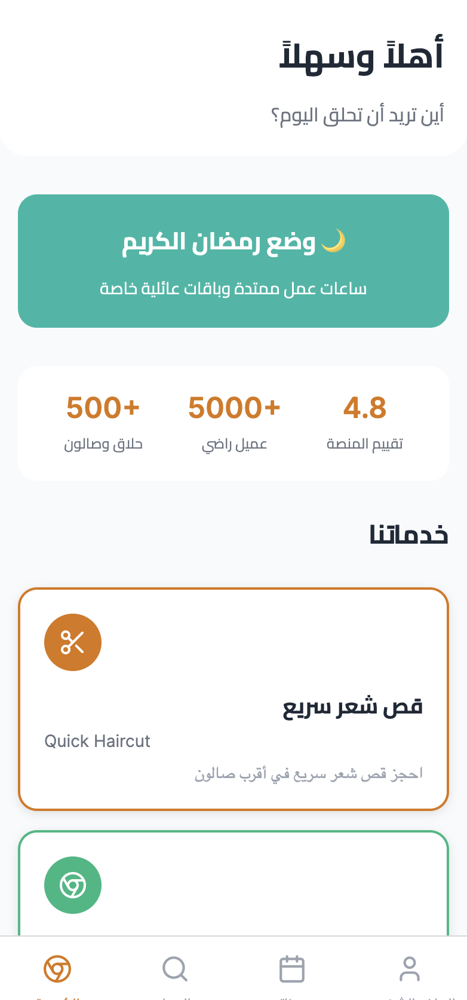

# ✂️ Al7ala9 – Your Personal Barber, Anywhere

**Al7ala9** is a smart and culturally-aware barber/hairdresser booking platform built for users who value time, convenience, and high-quality grooming. Whether you're preparing for **Eid**, a **wedding**, or just want a fresh look on **Friday**, Qassari makes it easy to find and book a trusted professional, either at home or at a local salon.

---

## 🚀 Features

- 🌙 **Ramadan Mode** – Extended hours, family bundles, and special offers during Ramadan.
- 🗺️ **Book Nearby** – Quickly find and book appointments at nearby salons.
- ✂️ **Quick Haircut** – Reserve a slot for a fast and clean haircut at your closest trusted barber.
- 👩‍🦰 **Gender-Specific Professionals** – Book female-only hairdressers for privacy and comfort.
- 🧕 **Culturally Tailored Experience** – Built for Muslim families and lifestyle events like Eid, Aqiqah, Jumu’ah, or 3ers.
- 📲 **Mobile-First** – Optimized for mobile with simple navigation, WhatsApp integration, and fast booking flow.
- 💵 **Flexible Payment Options** – Cash, CIH Pay, Orange Money, and on-site payment available.

---

## 📸 Preview

<p align="center">
  
</p>

---


## 🌐 Target Audience

- Busy professionals needing a reliable haircut fast
- Families looking to groom multiple members at home
- Women seeking private, trusted, hijabi hairdressers
- Moroccan diaspora gifting grooming services to family back home

---


## 🧪 Running Locally

```bash
git clone https://github.com/yourusername/qassari.git
cd qassari
npm install
npm run dev
